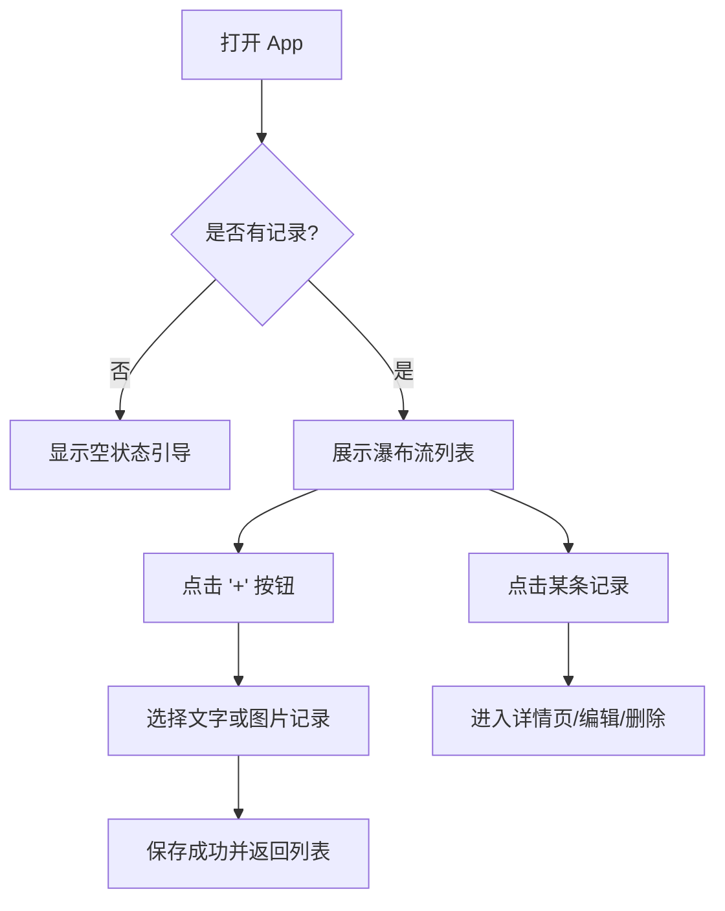

在我的日常生活中，浏览器各种社交媒体的时候，我总能发现网友的一些有趣的对话、梗图等。
在感叹网友的才华和创意的同时，我发现这些内容又总是一闪而过，没有什么持久性。
于是我计划开发一款产品，在人们预览到有趣的内容时，可以立即记录下来，
并提供一个简单的界面，方便用户查看和管理这些记录。产品名称就叫"meme"，"meme"是指在社交媒体上分享的有趣的图片、视频、文字等内容。
核心功能点: 先做一个MVP版本，功能上只实现最基本的记录、查看、管理功能。
1、记录，主要有文字，图片等记录方式
2、查看，用户可以在产品中查看自己记录的内容
3、管理，用户可以在产品中管理自己的记录，如删除、修改等

这是一个非常棒的切入点！“捕捉转瞬即逝的互联网灵感”是一个很强的高频痛点。在 2026 年，我们可以利用 AI 极大地缩短从“发现”到“记录”的路径。

根据你的描述，我为你设计了一份 **"meme" App 的 MVP 版本 PRD（产品需求文档）**。这份文档采用了适合喂给 AI（如 Cursor 或 v0.dev）的结构化格式。

---

# 产品需求文档 (PRD) - meme (MVP版本)

**版本：** v1.0 (MVP)
**目标：** 为用户提供一个极速、极简的工具，用于捕捉和管理社交媒体上的有趣内容（梗图、金句、对话）。

---

## 1. 产品概述

* **核心理念：** 互联网的幽默是转瞬即逝的，"meme" 是你的灵感剪贴簿。
* **用户价值：** 解决“看到好梗想留存，却在相册或收藏夹里石沉大海”的问题。

---

## 2. 用户故事 (User Stories)

* **捕捉：** 作为一个社交媒体重度用户，当我看到一段有趣的对话时，我希望能够一键复制并保存文字，或者截图上传图片。
* **回顾：** 作为一个内容创作者，我希望在刷手机休息时，能打开 meme 快速浏览我最近存下来的梗，激发灵感。
* **清理：** 作为一个极简主义者，我希望能够轻松删掉那些过时的、不再有趣的记录。

---

## 3. 功能性需求 (Functional Requirements)

### 3.1 记录模块 (Capture)

* **文字记录：**
* 支持粘贴长文本。
* 支持简单的 Markdown 格式（可选，增加可读性）。

* **图片记录：**
* 支持从相册选择图片。
* **核心优化：** 支持直接粘贴剪贴板中的图片。

* **自动属性：** 记录时自动保存“创建时间”。

### 3.2 查看模块 (View)

* **列表页：**
* 采用瀑布流或卡片式布局（类似 Pinterest），突出图片展示。
* 每条记录展示摘要、类型图标和时间。

* **详情页：**
* 点击卡片进入。图片支持点击放大，文字支持长按复制。

### 3.3 管理模块 (Manage)

* **编辑：** 用户可以修改已保存记录的文字内容。
* **删除：** 支持在列表页长按删除或详情页点击删除按钮。
* **快速归档（进阶逻辑）：** 左右滑动卡片可进行快速操作（如左滑删除）。

---

## 4. 边缘情况与处理 (Edge Cases)

* **网络断开：** 允许本地记录，等有网络时再同步（MVP 阶段可先做纯本地存储）。
* **空状态：** 当用户没有记录时，显示一个幽默的引导语（例如：“这里空空如也，快去捕捉网友的才华吧！”）。
* **超长文本/超大图：** 列表页进行截断处理，防止 UI 错乱；图片进行压缩显示。

---

## 5. 用户流程图 (User Flow)

---

## 6. 技术约束 (Technical Constraints)

* **前端：** React Native (跨平台手机端) 或 Next.js (Web PWA)。
* **存储：** MVP 阶段建议使用 **IndexedDB** 或 **Supabase**，方便 AI 快速集成。
* **隐私：** 声明数据仅存储在本地或个人账户下。

---

### 💡 接下来如何利用 AI 实施？

你可以直接把上面的 PRD 复制给 **Cursor** 或 **v0.dev**，并附带以下指令：

> **指令示例：**
> “我准备开发 PRD 里的这款名为 'meme' 的 App。请根据这份文档，先为我生成 **Next.js + Tailwind CSS** 的前端原型。要求使用卡片式布局，视觉风格参考 Apple 的 Journal App，要显得简洁、有呼吸感。请先完成‘列表页’和‘新增记录弹窗’的代码实现。”

**这份 PRD 是否涵盖了你脑海中“meme”的初衷？如果需要，我们可以进一步细化“一键抓取（比如通过系统分享链接直接记录）”的高级需求。**